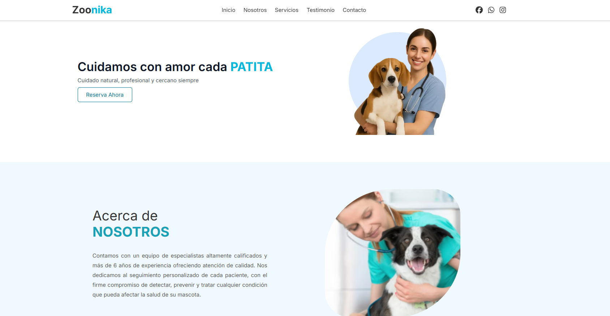

# Zoonika - Landing Page Veterinaria 🐾

## 📋 Descripción del Proyecto

**Zoonika** es una landing page moderna para una clínica veterinaria que busca conectar con dueños de mascotas ofreciendo servicios profesionales de cuidado animal. El sitio web incluye secciones informativas sobre los servicios, testimonios de clientes satisfechos, galería de momentos especiales, y un formulario de contacto para agendar citas.

La página está diseñada para generar confianza y captar nuevos clientes mediante un diseño atractivo, información clara de servicios, y facilidades para contactar directamente con la clínica.

## 🛠️ Tecnologías Utilizadas

- **HTML5** - Estructura semántica del sitio web
- **CSS3** - Estilos personalizados y diseño responsivo
- **TailwindCSS v4.1.10** - Framework de CSS para diseño rápido y consistente
- **JavaScript** - Interactividad y funcionalidades dinámicas
- **Astro v5.9.4** - Framework web moderno para sitios estáticos optimizados
- **Font Awesome** - Iconografía profesional
- **Google Fonts (Inter)** - Tipografía moderna y legible

## 📱 Vista Previa



## ⚙️ Requisitos Técnicos

Para ejecutar este proyecto localmente necesitas tener instalado:

- **Visual Studio Code** - Editor de código recomendado
- **Node.js v18+** - Entorno de ejecución de JavaScript
- **npm** - Gestor de paquetes (incluido con Node.js)

### Extensiones de VS Code recomendadas:

- **Astro** - Soporte para archivos .astro
- **Tailwind CSS IntelliSense** - Autocompletado para clases de Tailwind
- **Prettier** - Formateo automático de código

## 🚀 Instalación y Ejecución

1. **Clona el repositorio:**

   ```bash
   git clone <url-del-repositorio>
   cd zoonika
   ```

2. **Instala las dependencias:**

   ```bash
   npm install
   ```

3. **Ejecuta el servidor de desarrollo:**

   ```bash
   npm run dev
   ```

4. **Abre tu navegador en:** `http://localhost:4321`

## 📁 Estructura del Proyecto

```text
/
├── public/
│   ├── figma/
│   │   └── PROYECTO EN ANGULAR.fig
│   └── img/
│       ├── desktop-preview.png
│       ├── imgContacto.png
│       ├── imgVeterinaria.png
│       └── hero/
│           └── hero_img.webp
├── src/
│   ├── components/
│   │   ├── AcercaDeNosotros.astro
│   │   ├── Contacto.astro
│   │   ├── Footer.astro
│   │   ├── Galeria.astro
│   │   ├── HeaderNav.astro
│   │   ├── hero.astro
│   │   ├── Services.astro
│   │   └── Testimonials.astro
│   ├── layouts/
│   │   └── ZoonikaLayout.astro
│   ├── pages/
│   │   └── index.astro
│   └── styles/
│       └── global.css
├── astro.config.mjs
├── package.json
├── README.md
└── tsconfig.json
```

## 🎨 Diseño en Figma

El diseño completo del proyecto está disponible en Figma:

**🔗 [Ver diseño en Figma](https://www.figma.com/design/umfbBN4HaIZNLbf2NmDoRO/PROYECTO-EN-ANGULAR?node-id=32-2&t=G6ye4dcFT1BbbADP-1)**

### Archivo de Figma incluido:

- 📁 `public/figma/PROYECTO EN ANGULAR.fig` - Archivo nativo de Figma del proyecto

## 🧞 Comandos Disponibles

Todos los comandos se ejecutan desde la raíz del proyecto:

| Comando           | Acción                                               |
| :---------------- | :--------------------------------------------------- |
| `npm install`     | Instala las dependencias del proyecto                |
| `npm run dev`     | Inicia el servidor de desarrollo en `localhost:4321` |
| `npm run build`   | Construye el sitio para producción en `./dist/`      |
| `npm run preview` | Previsualiza la construcción localmente              |

## 🌟 Características

- ✅ **Diseño Responsivo** - Adaptado para desktop, tablet y móvil
- ✅ **Navegación Suave** - Enlaces internos con scroll suave
- ✅ **Formulario de Contacto** - Para agendar citas y consultas
- ✅ **Galería de Imágenes** - Momentos especiales con las mascotas
- ✅ **Testimonios** - Reseñas de clientes satisfechos
- ✅ **Optimización SEO** - Meta tags y estructura semántica
- ✅ **Carga Rápida** - Optimizado con Astro para máximo rendimiento
- ✅ **Iconografía Profesional** - Font Awesome integrado

## 👥 Equipo de Desarrollo

### Desarrolladores Frontend
- **Johann Gudwig Camiloaga Cuenca** - Desarrollador
- **Rodriguez de la Cruz Jhonny J.** - Desarrollador  
- **Ortiz Gil Kengyo Jerdly** - Desarrollador

### Diseño UX/UI
- **Ponce de León Alfaro Melani Nicoll** - Diseñadora

---

**¿Necesitas ayuda?**

- 📖 [Documentación de Astro](https://docs.astro.build)
- 💬 [Discord de Astro](https://astro.build/chat)
- 🎨 [Documentación de TailwindCSS](https://tailwindcss.com/docs)
